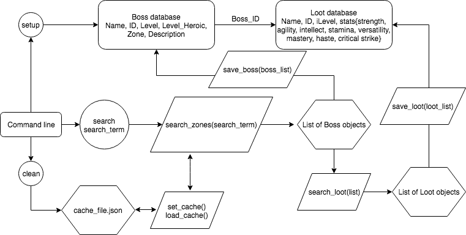
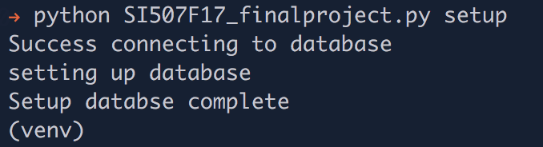
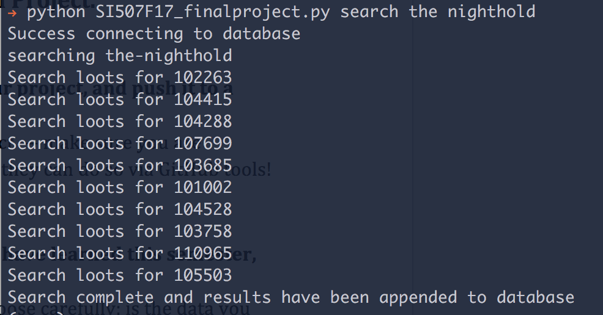
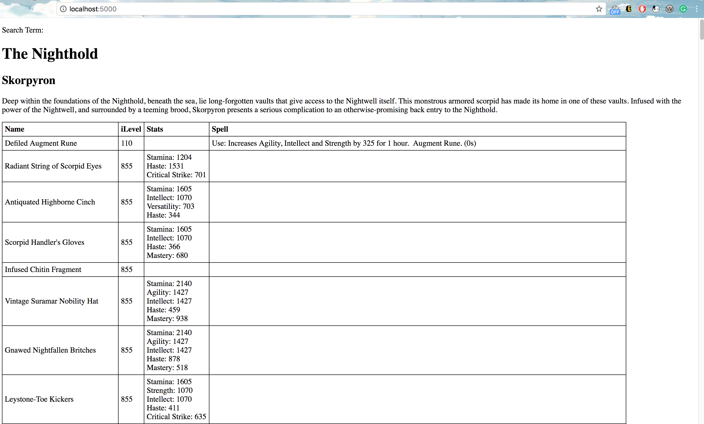

# WoW_BossLootAPI
An api to search for bosses and their loots in a certain dungeon/raid and store data to SQL tables

Flow chart of working logic:



## Setup
Required packages to run the program are included in the ```requirements.txt```.
Use ```pip install -r requirements.txt``` to install the required packages.

Also, this program requires the existence of a local database.
Refer to [this](https://paper.dropbox.com/doc/SI-507-Lecture-10-November-8-2017-SQL-PostgreSQL-databases-Python-HYWWXqZ5XJn4eMDXRBFUC) about how to setup local database

Run ```pg_ctl -D /usr/local/var/postgres start``` from command line to start the server

Create a local database called wow_loot by ```createdb wow_loot``` from command line

Run ```python3 SI507F17_finalproject.py setup``` to create tables in the database
This is the screen you should see after setting up:


##Use
Run ```python3 SI507F17_finalproject.py search "zone name"``` to search for boss and loots in a zone. Such as:
```python3 SI507F17_finalproject.py search the nighthold```
This is the screen you should see after searching:


For visualization, run ```python3 app.py runserver``` from command line, and then access localhost with port shown in terminal, and this should be seen in the browser:



